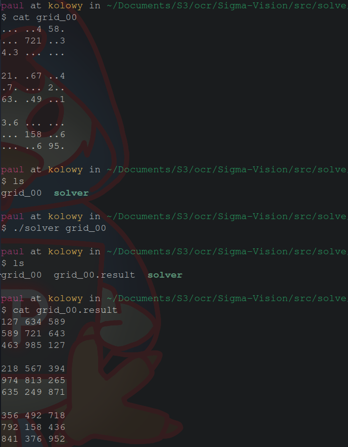

Le solve a pour but de resoudre le sudoku, comme son nom l'indique.


# Liste des fonctions :

void print(int grid[N][N]) : 
 * Input : grid [N][N]
 * Describtion : print the fonction


int check_move(int grid[N][N], int row, int col, int n)
 *  Input : grid[N][N], row and col for the new int n
 *  Output : 0 if pb else 1
 *  Description : test if a int can be placed at the pos [row][col]


int solve(int grid[N][N], int row, int col)
 * Input : grid[N][N], row and col (0 if first call)
 * Output : 0 if fail else 1
 * Description : solve the sudoku


void read(int grid[N][N], char* name)
* Input : name of a file
* Output : the grid[N][N] of the file
* Description : make a grid with a file


void write(int grid[N][N], char name[])
* Input : name of a file
* Description : make a file with a grid


int solve_file(char name[])
* Input : name of a file
* Description : main fonction, solve a file `$name` and create a `$(name).result`


# Input 

En entrée ce programme prends un nom de ficher `$name`.

Un fichier valide doit avoir :
- un `.` a la place des cases vides
- des espaces pour representer les barres verticales des grilles de sudoku
- des retours a la ligne a la fin des 9 cases
- des retours a la ligne pour representer les barres horizontal des grilles de sudoku

Par exemple ce fichier est celui donné dans la consigne.
```
... ..4 58.
... 721 ..3
4.3 ... ...

1.  .67 ..4
.7. ... 2..
63. .49 ..1

3.6 ... ...
... 158 ..6
... ..6 95.
```

# Output

En sortie, ce ficher sortira un ficher de nom `$(name).result`.

Le fichier respectera les memes specifications.

Le resultat du fichier precedent donnera

```
127 634 589
589 721 643
463 985 127

218 567 394
974 813 265
635 249 871

356 492 718
792 158 436
841 376 952
```

## Comment ca marche ?

Ce programme marche depuis un simple `backtracking algorithm`

![Voici un gif de wikipedia qui explique le fonctionnement :]
(https://upload.wikimedia.org/wikipedia/commons/8/8c/Sudoku_solved_by_bactracking.gif)

En bref, un programme résoudrait un puzzle en plaçant le chiffre "1" dans une cellule et vérifi s'il est autorisé à s'y trouver.

- S'il n'y a aucun probleme , l'algorithme passe à la cellule suivante et y place un "1". 
- Si l'on découvre que le "1" n'est pas autorisé, la valeur est avancée à "2".
- Si l'on découvre une cellule où aucun des 9 chiffres n'est autorisé, l'algorithme laisse cette cellule vide et revient à la cellule précédente. La valeur de cette cellule est alors incrémentée de un. Cette opération est répétée jusqu'à ce que la valeur autorisée soit découverte dans la dernière (81e) cellule.


Un **probleme** peut etre lié à :
- contraintes de ligne
- contraintes de colonne
- contraintes de case


# Resultat : 

